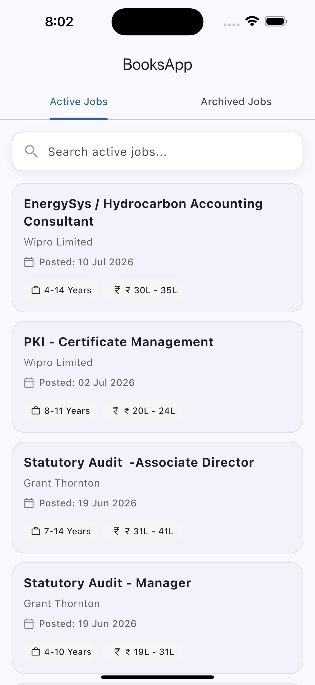

# 💼 Job Listing App

A modern Flutter application that displays **Active** and **Archived** job listings using REST APIs. The application follows clean coding practices using **Provider** for state management and offers a smooth user experience with search functionality, loading indicators, error handling, and detailed job information.

<p align="center">
  
</p>

---

## ✨ Features

- 📋 Browse Active Job Listings
- 🗂 Browse Archived Job Listings
- 🔍 Search jobs by title or company
- 📄 Detailed Job Information Screen
- 🌐 HTML Job Description Rendering
- ⚡ REST API Integration
- 🧠 Provider State Management
- ⏳ Skeleton Loading UI
- 📭 Empty State Handling
- ❌ Error State Handling
- 📱 Responsive Material UI

---

## 📸 Application Preview

> Replace the image below with your application screenshot.

```
screenshots/
└── app_preview.png
```

---

## 🏗 Architecture

```
                UI (Screens)
                     │
                     ▼
              Provider (State)
                     │
                     ▼
             Service (API Layer)
                     │
                     ▼
                REST APIs
```

---

## 📂 Project Structure

```text
lib/
├── models/
│   └── job_model.dart
│
├── providers/
│   └── job_provider.dart
│
├── services/
│   └── job_service.dart
│
├── screens/
│   ├── home_screen.dart
│   ├── active_jobs_screen.dart
│   ├── archived_jobs_screen.dart
│   └── job_details_screen.dart
│
├── widgets/
│   ├── custom_search_bar.dart
│   ├── job_card.dart
│   └── skeleton_job_list.dart
│
└── main.dart
```

---

## 🚀 Tech Stack

| Technology | Usage |
|------------|-------|
| Flutter | UI Development |
| Dart | Programming Language |
| Provider | State Management |
| HTTP | REST API Calls |
| flutter_html | HTML Rendering |
| intl | Date Formatting |

---

## 🌐 REST APIs

### Active Roles

```
https://api.wraeglobal.com/roleRouter/getActiveRoles
```

### Archived Roles

```
https://api.wraeglobal.com/roleRouter/getArchivedRoles
```

---

## 📱 Implemented Screens

- Home Screen
- Active Roles
- Archived Roles
- Job Details
- Search
- Loading State
- Empty State
- Error State

---

## 🔍 Search Functionality

Users can search jobs locally using:

- Job Title
- Company Name

The search updates instantly without making additional API calls.

---

## 📄 Job Details

Each job includes:

- Company Name
- Experience
- Salary Range
- Number of Positions
- Referral Amount
- Posted Date
- Closing Date
- Job ID
- HTML Job Description

---

## 📦 Packages Used

```yaml
provider:
http:
flutter_html:
intl:
```

---

## ▶ Getting Started

### Clone Repository

```bash
git clone https://github.com/your-username/job-listing-app.git
```

### Go to Project

```bash
cd job-listing-app
```

### Install Packages

```bash
flutter pub get
```

### Run Project

```bash
flutter run
```

---

## ✅ Assignment Requirements

- ✔ Fetch Active Roles
- ✔ Fetch Archived Roles
- ✔ Provider State Management
- ✔ Search Functionality
- ✔ Job Details Screen
- ✔ REST API Integration
- ✔ Loading State
- ✔ Empty State
- ✔ Error State
- ✔ Clean Flutter UI

---

## 👨‍💻 Developed By

**Rahul Kumar Sah**

🌐 Portfolio  
https://www.rahulkumarsah.com

💻 GitHub  
https://github.com/<your-github-username>

💼 LinkedIn  
https://www.linkedin.com/in/rahul-kumar-sah-083212250

---

## ⭐ Support

If you found this project helpful, consider giving it a **⭐ Star** on GitHub.
